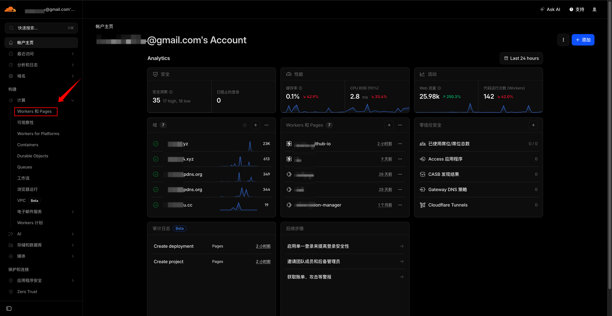
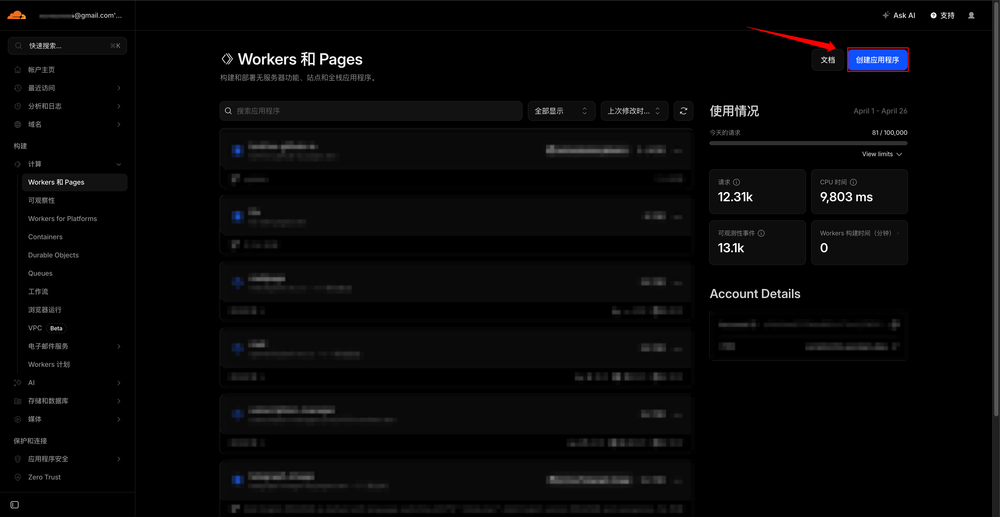
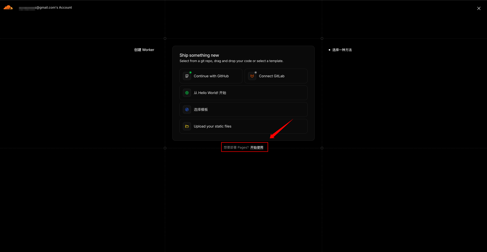
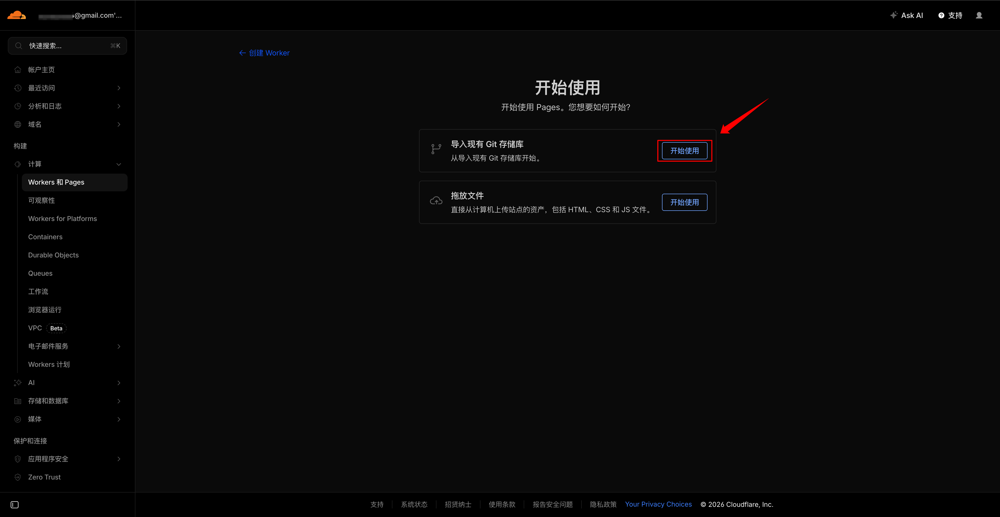
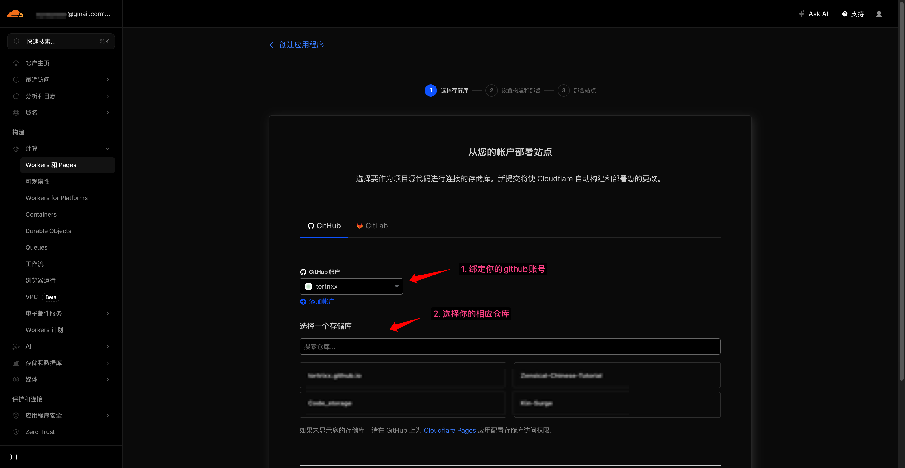
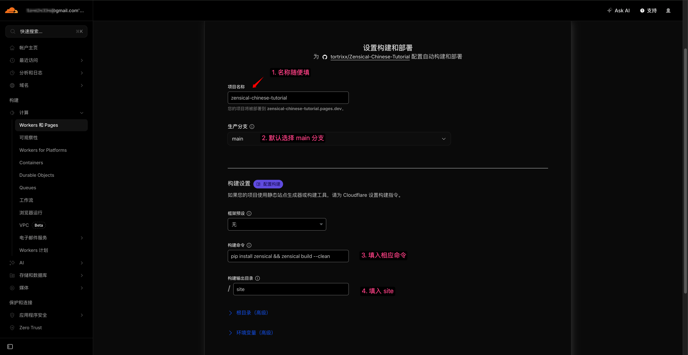
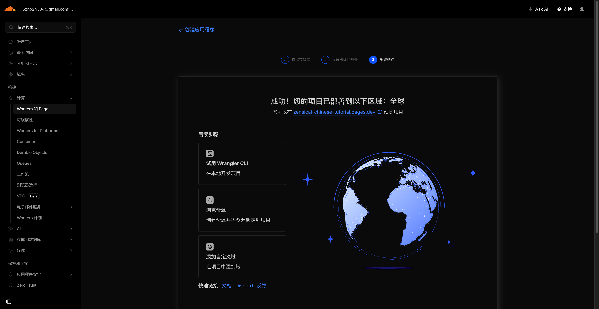

# Cloudflare Pages 部署

> 使用 Cloudflare Pages 免费托管你的 Zensical 网站，支持私有仓库、全球 CDN、自动 HTTPS

对于想保持仓库 **私有** 的用户，Cloudflare Pages 是目前最好的选择之一。它完全免费、速度快、支持私有 GitHub 仓库，且配置非常简单。

## 为什么选择 Cloudflare Pages？

- ✅ **完全支持私有仓库**（GitHub Free 用户也能用）
- ✅ **全球 CDN** + 边缘计算，国内访问速度优秀
- ✅ **自动 HTTPS** + 免费自定义域名
- ✅ **自动构建** + PR 预览部署
- ✅ **几乎无限制** 的免费额度

## 准备工作

在开始之前，确保你已经：

- 拥有 GitHub、[Cloudflare](https://dash.cloudflare.com/sign-up) 账号
- 项目已推送到 GitHub 仓库（私有仓库也没问题）
- 本地测试过 `zensical build --clean` 能正常生成 `site/` 目录

!!! info "注意"
	以下操作步骤附有图片，如果图片看不清可右键选择`在新标签页打开`

## 部署步骤（推荐方式）

### 第一步：进入 Cloudflare Pages，左侧菜单点击 **Workers & Pages**

1. 打开 [Cloudflare Dashboard](https://dash.cloudflare.com/)

    

2. 右上角选择按钮 **Create application (创建应用程序)**

    

3. 选择 **Pages**

	

4. **导入现有 git 存储库**

	

### 第二步：连接 GitHub 仓库

1. 授权 Cloudflare 访问你的 GitHub 账号

2. 选择你的 Zensical 项目仓库（支持私有仓库）

	


### 第三步：配置构建和部署（关键！）

填写以下信息：

| 项目            | 设置值                                      |
|-----------------|---------------------------------------------|
| **项目名称**    | 随意设置 |
| **生产分支**    | `main`（或你的默认分支）                    |
| **框架预设**    | **无**                                      |
| **构建命令**    | `pip install zensical && zensical build --clean` |
| **构建输出目录**| `site`                                      |

- 建议勾选 **非生产分支构建**（方便 PR 预览）
- 其他高级设置暂时留空



### 第四步：保存并部署

点击右下角 **保存并部署**（Save and Deploy）

Cloudflare 会自动拉取代码、执行构建命令、部署 `site/` 目录。

### 第五步：查看部署结果

- 部署成功后会自动给你一个 `.pages.dev` 域名（如 `https://zensical-chinese-tutorial.pages.dev/`）
- 以后每次 `git push` 到 `main` 分支，Cloudflare 就会自动重新构建和部署



## 配置自定义域名（可选）

1. 在 Cloudflare Pages 项目中 → **Custom domains** → **Add**
2. 输入你的域名 → 保存
3. 在域名 DNS 提供商处添加 CNAME 记录：
   - 类型：`CNAME`
   - 名称：`@` 或 `www`
   - 值：`你的项目.pages.dev`
4. Cloudflare 会自动验证并开启 HTTPS

## 配置 site_url（重要）

在项目根目录的 `zensical.toml` 中添加或修改：

```toml
[project]
site_url = "https://你的项目.pages.dev/"   # 注意末尾必须带 /
```

!!! tip "常见问题"
    Q：构建失败显示 pip / zensical 命令找不到？

    A：确保构建命令写成 `pip install zensical && zensical build --clean`

    Q：样式丢失或链接错误？

    A：检查 `site_url` 是否正确且以 `/` 结尾

    Q：想换回 GitHub Pages？

    A：随时可以切换，Cloudflare Pages 不影响你的 GitHub 仓库。
